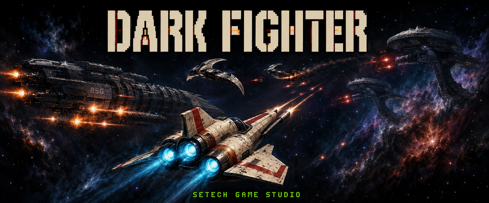

# Dark Fighter



`Dark Fighter` to nieoficjalny, hobbystyczny i niekomercyjny fan-art
`Battlestar Galactica`: pionowa strzelanka kosmiczna dla stockowego Atari 65XE
PAL z 64 KB RAM. Gracz pilotuje Vipera przeciwko myśliwcom Cylonów. Projekt
nie jest oficjalnym produktem ani nie sugeruje związku lub poparcia
właścicieli marki; wszystkie dane Atari, grafiki, animacje, audio i kod
powstają od nowa dla tego projektu.

## Bieżący vertical slice

Zaakceptowany build `0.1.1` potwierdza przenośny łańcuch builda i pierwszy
ekran gameplayu. Obecnie zawiera:

- sterowanie joystickiem w porcie 1 i strzelanie pojedynczym FIRE;
- jednego przeciwnika z czerwonym skanerem, sprzętowe PMG, kolizje i score;
- przewijany playfield ANTIC 4, czytelny dwuwierszowy HUD ANTIC 2 z osobnym
  fontem oraz efekty POKEY;
- oryginalne 32-wierszowe kadłuby boczne ANTIC 4 w układzie nominalnym
  `8 + 24 + 8`, z jedną funkcjonalną, wielokomórkową baterią na stronę w
  każdym segmencie i niezależnym, o połowę wolniejszym ruchem kadłubów;
- deterministyczny crossfire broadside: 25-ramkowe rosnące ostrzeżenia przy
  źródłowych wylotach, stała pula trzech ciężkich pocisków M1–M3, trafienia
  gracza, przeciwnika i przeciwnego kadłuba, 24-ramkowe czerwone eksplozje
  3×3 przy kadłubie oraz zsynchronizowany crack/rumble POKEY;
- trzy dokładne ustawienia prędkości świata: `EASY` 20, `MEDIUM` 22,5 i
  `HARD` 25 pełnych wierszy/s; niezależnie rzadszy harmonogram salw oraz
  source-derived kontakt gracza z nieregularnymi krawędziami i turretami;
- samowystarczalny XEX oraz bootowalny ATR dla emulatora i SIO2SD;
- pięciosekundowy loader mieszający ANTIC F z footerem ANTIC E: bitmapę
  7680 B, Galactikę
  z `BSG`, kremowy tytuł, zielone `SETECH GAME STUDIO`, dwa LMS, dwa DLI
  i dokładnie 250 pełnych ramek PAL;
- czytelny, mieszany frontend ANTIC 7/6/4/2: duży tytuł, hangar i Viper po
  lewej, opcje po prawej oraz ekrany `OPTIONS`, `TOP SCORES`, potwierdzenie
  `EXIT`, `SOUND: ON/OFF` oraz sesyjny wybór `EASY/MEDIUM/HARD`;
- czyste przejście z loadera do menu, a następnie przez `START GAME` do
  istniejącego gameplayu, bez kosztu loadera w gameplay main loop lub
  gameplay VBI.

## Docelowa gra

Docelowo Viper stale leci przez powtarzalne poziomy, walczy z różnymi rolami
Cylon fighters i unika zagrożeń. Open space będzie przeplatać się z
zapowiadanymi korytarzami bitwy między Battlestarem po lewej i Cylon capital
ship po prawej. Plan obejmuje hull percentage, zniszczenie i restart, debris
z zawsze osiągalną trasą, wybór między zebraniem i zestrzeleniem repair drone,
proceduralne fale, kontrolowaną losowość oraz broadside crossfire bez faction
immunity.

Poza wskazanym vertical slice te systemy są **planowane i nie są jeszcze
zaimplementowane**. Kanoniczne
decyzje i statusy znajdują się w
[`docs/game-design.md`](docs/game-design.md), kolejność prac w
[`docs/roadmap.md`](docs/roadmap.md), a stan obecny i docelowe granice systemów
w [`docs/architecture.md`](docs/architecture.md).

Gra pozostaje jednym resident gameplay programem bez ładowania pakietów między
normalnymi poziomami. Title loader jest jedyną obecną fazą ładowania.

## Wymagania builda

- Node.js 24 lub nowszy;
- npm;
- macOS Intel albo Windows;
- opcjonalnie Altirra (Windows), Atari800 lub Atari800MacX;
- dla prawdziwego Atari: SIO2SD i karta SD.

Nie trzeba instalować natywnego `cc65`. Przypięty `ca65/ld65` działa przez
WebAssembly, dzięki czemu macOS Intel i Windows używają tego samego toolchainu.

## Build i walidacja

```bash
npm install
npm run build
npm test
npm run preview
npm run verify
npm run package
```

Najważniejsze wyniki w `dist/`:

- `dark-fighter.xex` — program wykonywalny dla emulatora;
- `dark-fighter.atr` — standardowy obraz 90 KB bootujący bez DOS-u;
- `dark-fighter-boot.bin` — surowy payload sektorów startowych;
- `dark-fighter-manifest.json` — adresy, rozmiary i sumy kontrolne;
- `dark-fighter-0.1.1.zip` — archiwum wydania tworzone przez `npm run package`.

Standardowy ATR ma dużo miejsca na nośniku, ale ta pojemność nie jest
dodatkowym resident RAM podczas gameplayu.

## Deterministyczne preview

`npm run preview` tworzy:

- `build/previews/loader-screen.png` z
  `assets/graphics/loader-bitmap.json`;
- `build/previews/start-menu.png` z tych samych danych menu, charsetu, PMG i
  palety, których używa program;
- `build/previews/gameplay-screen.png` z kanonicznych danych `src/main.s` oraz
  `assets/graphics/capital-hulls.json`;
- `build/previews/capital-hulls-strip.png` z pełnego segmentu kadłubów,
  glifów i metadanych `assets/graphics/capital-hulls.json`;
- `build/previews/enemy-hull-colour-options.png` z identycznych danych prawego
  kadłuba wyrenderowanych przez `COLPF3=$44` i `$46` do oceny ownera.
- `build/previews/broadside-fire-sequence.png` jako sześcioklatkowy,
  source-derived zapis warning, lotu oraz trafień broadside.
- `build/previews/broadside-acceptance-sequence.png` jako dziesięcioklatkowy
  zapis faz ładowania działa, launch, obu clampów, damage flash i zero health.
- `build/previews/player-respawn-sequence.png` jako dziesięcioklatkowy zapis
  bezpiecznego przejścia wierszy kadłubów przy wyśrodkowanym Viperze, realnych
  kontaktów, śmierci, centralnego respawnu oraz granic 250-klatkowego blink/invulnerability.
- `build/previews/broadside-cadence-sequence.png` jako source-derived oś czasu
  1000 ramek, porównująca warningi, launch i ticki scrollu przed i po korekcie.
- `build/previews/broadside-speed-sequence.png` jako pięć kolejnych ramek PAL
  pokazujących dwa kroki świata, pierwszy oddzielny krok kadłubów, warning
  pozostający przy wylocie i stały ruch pocisku.
- `build/previews/difficulty-speed-comparison.png` jako dokładne porównanie
  zdarzeń scrolla `EASY/MEDIUM/HARD` w tym samym 20-ramkowym oknie PAL.
- `build/previews/flagship-sector-sequence.png` jako kolejność ENGINES, AFT,
  COMBAT, FORWARD, PROW, terminalne bow tips, DRAIN i COMPLETE.
- `build/previews/capital-hull-explosion-sequence.png` jako sześć faz dużej
  eksplozji 3×3, wraz z `capital-explosion-pokey-trace.csv` zawierającym
  24-ramkową obwiednię AUDF4/AUDC4 i końcowe wyciszenie.

Podstawowe obrazy mają 640×384, a pełny 32-wierszowy pas kadłubów 640×512.
Wszystkie są skalowane całkowicie nearest-neighbour i powstają bez
zewnętrznego narzędzia graficznego. Kolory RGB są stabilnym przybliżeniem
rejestrów Atari PAL, więc mogą nieznacznie różnić się od konkretnego emulatora
lub fizycznego odbiornika. Zaakceptowanego loader assetu nie należy zmieniać
podczas implementacji planowanych systemów gameplayu.

W Atari800 należy osobno przypisać joystick hosta do portu 1; samo wskazanie
XEX nie tworzy mapowania wejścia.

## Atari 65XE i SIO2SD

1. Skopiuj `dist/dark-fighter.atr` na kartę SD.
2. Zamontuj obraz jako `D1:` w SIO2SD.
3. Podłącz joystick do portu 1.
4. Włącz Atari z wciśniętym `OPTION`, aby wyłączyć BASIC.
5. Sprawdź loader widoczny dokładnie przez pięć sekund i automatyczne przejście
   do menu.
6. Sprawdź nawigację menu, ekrany podrzędne i uruchomienie gry przez
   `START GAME`.
7. Sprawdź ruch we wszystkich kierunkach oraz FIRE w gameplayu.

Emulator jest koniecznym, ale niewystarczającym testem. Procedura raportowania
real hardware znajduje się w
[`docs/hardware-testing.md`](docs/hardware-testing.md).

## Struktura

```text
src/                    kod 6502
cfg/                    konfiguracja linkera
assets/                 edytowalne źródła grafiki, muzyki i SFX
levels/                 przyszłe data-driven definicje poziomów
scripts/                przenośny build, preview i walidacja
tests/                  testy formatów i kontraktów
docs/                   projekt gry, architektura, roadmapa i ADR-y
dist/                   wygenerowane pliki do uruchomienia
```
