# Dark Fighter

### A complete vertical space-combat game for the Atari 65XE, built for PAL in NMOS 6502 assembly

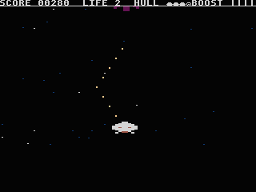

**Atari 65XE · 64 KB · PAL · 50 FPS · NMOS 6502 assembly**

[Download the XEX](dist/dark-fighter.xex) · [Boot the ATR](dist/dark-fighter.atr)

Pilot a Colonial Viper through open space and the narrow crossfire corridor
between opposing capital ships. Fight Cylon Raiders, dodge or destroy drifting
debris, survive heavy broadside fire, and collect the Rapid Fire weapon capsule.
The current release is fully playable in an emulator and on an Atari through
SIO2SD.

## Gameplay gallery

Every image below is an unenhanced frame from the packed release XEX running in
Atari800 7.1.2 in PAL/XL mode. Only Atari800's eight-pixel side borders were
cropped to produce the native 320×240, 4:3 image. The complete source frame and
artifact hashes are recorded in [`docs/media/manifest.json`](docs/media/manifest.json).

| | |
|---|---|
| 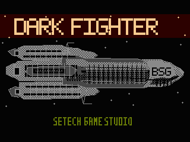 | 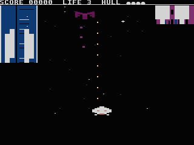 |
| **Loader and title art** — the boot handoff begins with a timed PAL presentation. | **Standard combat** — Viper, Raider, projectiles, starfield, and scrolling capital hulls. |
| 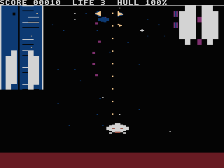 | 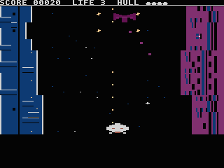 |
| **Raider breakup** — a local core and four deterministic fragments accompany the yellow-red screen flash. | **Destructible debris** — three hits break a neutral obstacle apart without awarding points. |
| 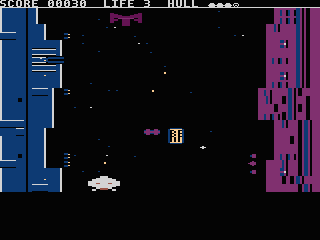 |  |
| **Rapid Fire pickup** — a large 2×2 ANTIC 4 capsule appears after three qualifying Raider kills. | **Rapid Fire active** — the HUD counts down while newly fired Viper shots are red and use the faster firing cadence. |
| 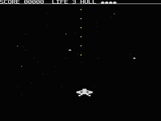 | 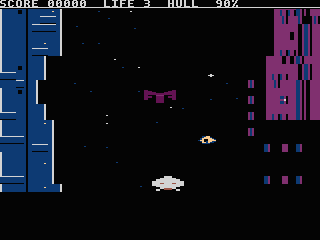 |
| **Capital broadside** — opposing hulls exchange deterministic heavy fire around the player. | **Capital engines** — the existing two engine phases pulse at an exact 8+8-frame cadence. |

## The story

Dark Fighter began in 1990, when I started creating a space-combat game for the
Atari 65XE. Decades later, I recovered the surviving project material from
5¼-inch floppy disks using an Atari computer and SIO2SD, transferred it to a
modern cross-development environment, and completed a full playable release
with AI-assisted engineering.

The tools changed. The target did not: real 6502 code, real PAL timing, real XEX
and ATR images, and validation on Atari hardware.

> Dark Fighter is a return to programming for the joy of making a machine do
> something that initially seemed impossible.

The original vision, gameplay decisions, constraints, and Definition of Done
remain owner-led. Codex assists with implementation, testing, analysis, and
documentation. Every feature is validated automatically and then played by the
owner; commit and push happen only after owner acceptance.

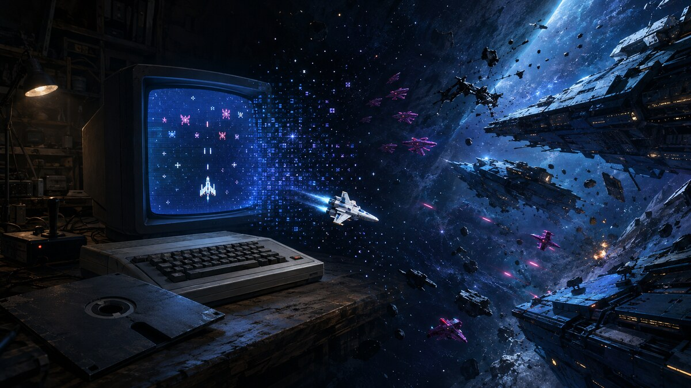

*Concept art — From Floppy to the Stars. An AI-assisted visualization of the project’s journey from its 1990 origins to the current release. Not an in-game screenshot.*

## What you can play now

- A complete loader, main menu, options, top-scores screen, pause menu, life
  cycle, respawn, and Game Over flow.
- Joystick control in port 1 and ten-shot Viper bursts from the single fire
  button.
- Three exact world-speed settings: EASY at 20 rows/s, MEDIUM at 22.5 rows/s,
  and HARD at 25 rows/s.
- A PMG Viper and Cylon Raider with deterministic movement, firing, collision,
  scoring, sound, and yellow-red destruction flashes.
- Open-space and capital-ship corridor sectors with two independently scrolling
  hulls, animated engine banks, turrets, warning phases, and M1–M3 broadside
  crossfire.
- Neutral armour-shard and truss-fragment debris with three HP, deterministic
  trajectories, local hit feedback, a breakup core, and four non-colliding
  fragments.
- Local Raider breakup effects that reuse the fixed transient-effects system.
- A 2×2 Rapid Fire weapon capsule earned after every third qualifying Raider
  projectile kill: 30 active frames pending, then a collectible that enables
  exactly 500 active PAL frames of 2-frame burst spacing, red projectiles, and
  an `RF10` through `RF01` HUD countdown.
- POKEY music and sound effects, including weapon, collision,
  explosion, broadside, and capital-hull feedback.
- A self-contained XEX and a bootable 90 KB ATR for emulators or SIO2SD.

## Engineering an Atari game today

Dark Fighter is not a browser reimplementation. The distributed files contain
the same NMOS 6502 runtime that is assembled, linked, packed, booted, traced,
and tested by the repository.

| Constraint or system | Current release |
|---|---|
| CPU and machine | Atari 65XE, NMOS 6502C, 64 KB RAM |
| Video target | PAL, 50 FPS, ANTIC 2/4/6/7/F and PMG |
| Toolchain | ca65/ld65 through the pinned WebAssembly package |
| Distribution | 16,396-byte XEX and 92,176-byte bootable ATR |
| Boot payload | Exactly 16,384 bytes in 128 sectors, loaded at `$2000`, entry `$201E` |
| Payload reserve | 518 source-owned bytes after runtime payload compaction |
| Runtime BSS | `$8000–$80FF`, exactly 256 bytes |
| Entity engine | Four physical interactive slots, up to two active |
| Effects engine | Six physical transient slots, up to five active |
| Entity code | `$9100–$9780`, 1,665 of 3,840 bytes before packing |
| Gameplay layers | base/ring → broadside → projectile → entity → effect; reverse erase |
| Charset budget | Glyphs 0–123 used; glyphs 124–127 free |
| Measured PAL wall | 32,956 cycles worst case; 2,612 cycles physical headroom |
| Synchronization | Zero missed frames, deadline overruns, or extra VBI boundaries in the full trace |

Visible-frame work is deterministic and bounded. Pools have fixed capacity;
overflow behavior is explicit. Cold-RAM tests use both `$A5` and `$5A` fills so
runtime correctness cannot depend on friendly power-on memory. The full PAL
trace runs instrumented Atari800 at guest-PC boundaries against the actual XEX
and ATR payload, including the heaviest combination of projectiles, debris,
pickups, broadside fire, and five transient effects.

The current repository validates more than 300 contracts covering formats,
memory ownership, rendering, backing and reverse erase, RNG and cadence,
gameplay lifecycle, real-artifact boot smoke, and runtime wall timing. Exact
measurements are kept in
[`docs/runtime-wall-trace.json`](docs/runtime-wall-trace.json) and explained in
[`docs/runtime-headroom.md`](docs/runtime-headroom.md).

## Development workflow

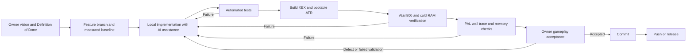

The editable Mermaid source is
[`docs/diagrams/development-workflow.mmd`](docs/diagrams/development-workflow.mmd).

### Git and SDLC

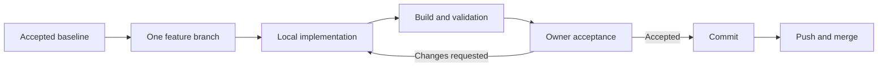

The editable source is
[`docs/diagrams/git-feature-lifecycle.mmd`](docs/diagrams/git-feature-lifecycle.mmd).

The working rules are deliberately strict:

- one focused feature per branch, always starting from an explicit accepted
  baseline;
- a small, closed scope with memory and PAL budgets stated before coding;
- code, generated data, tests, and relevant technical documentation updated
  together;
- no commit or push before automated validation and owner gameplay acceptance;
- XEX and ATR tested as executable products, not merely as structurally valid
  files;
- final diff review for memory overlap, page crossings, layer order, backing,
  determinism, packaging parity, and unintended scope;
- repository documentation and measured build outputs remain the sources of
  truth when an older report disagrees.

## Art direction and asset sets

### In-game assets

These sheets are generated from the current PMG, ANTIC 4, projectile, effect,
and capital-hull source data. They show assets used by the release; no new art
is invented for the sheets.

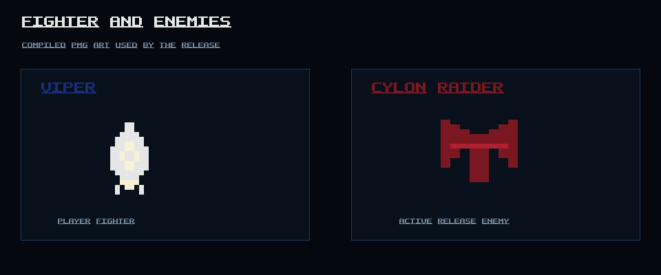

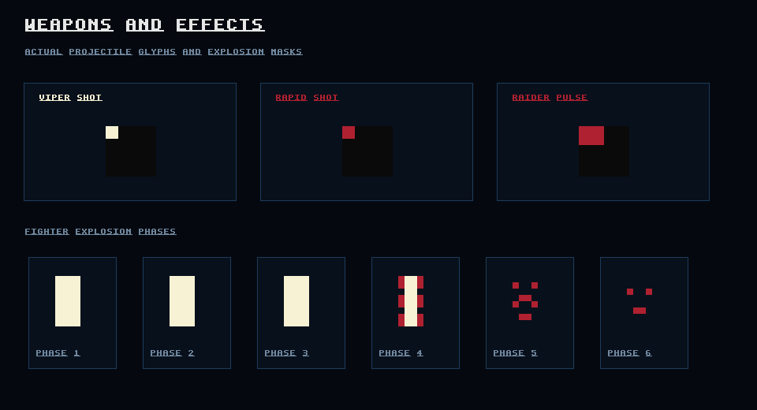

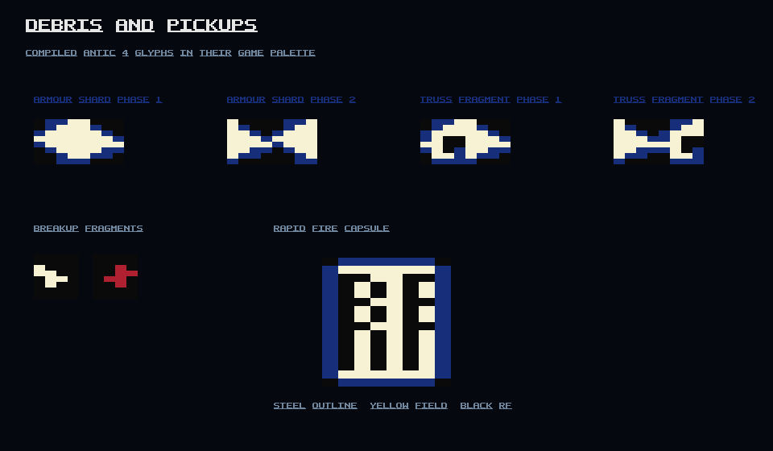

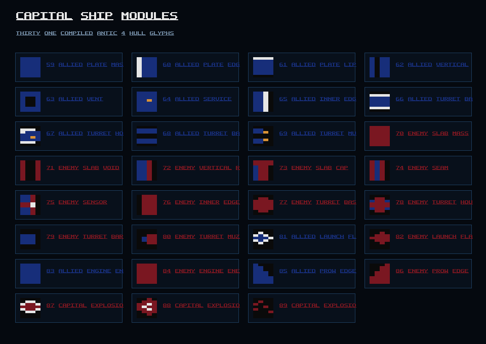

Regenerate the deterministic sheets and media manifest with:

```bash
npm run showcase
```

Use `npm run showcase -- --capture` only when fresh Atari800 gameplay frames
are required; it captures the packed release through the existing runtime trace
harness.

### Art direction and concepts

The visual direction is worn military science fiction: restrained hull
palettes, hard silhouettes, readable hazards, compact instrumentation, and
bright weapon accents against deep space. Future illustrations may be added to
this section, but every such image will be explicitly labeled **concept art**.
Concept art will never be presented as a gameplay screenshot.

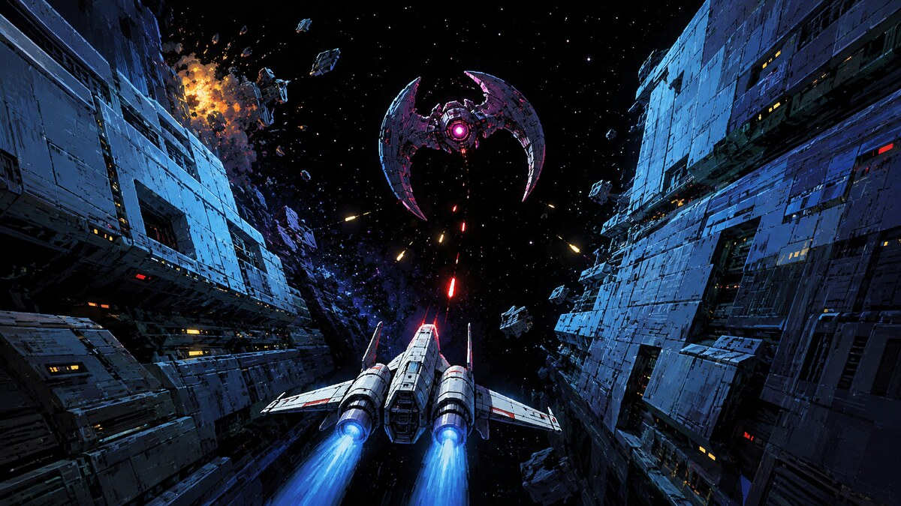

*Concept art — Gauntlet Run. An AI-assisted visualization of the intended scale, atmosphere and future battlefield composition. Not an in-game screenshot.*

## Build and play

### Requirements

- Node.js 24 or newer and npm;
- macOS or Linux for the commands below (the pinned WebAssembly assembler also
  keeps the project portable to the documented Windows build path);
- Atari800 for emulator play and release-runtime verification;
- optionally, an Atari 65XE, joystick, SIO2SD, and SD card for real hardware.

No system-wide cc65 installation is required.

### Build and validate

```bash
npm ci
npm run build
npm test
npm run preview
npm run verify
```

The release artifacts are written to `dist/`. Generated build and preview files
belong in `build/` and `dist/`; source assets remain under `assets/`.

### Run the XEX in Atari800

```bash
atari800 -xe -pal -nobasic -run dist/dark-fighter.xex
```

### Boot the ATR in Atari800

```bash
atari800 -xe -pal -nobasic dist/dark-fighter.atr
```

Map the host joystick to Atari port 1. Use the joystick to move, FIRE to shoot
or select menu entries, and the physical/console `OPTION` key to enter the
in-game pause menu.

### Run on an Atari through SIO2SD

1. Copy `dist/dark-fighter.atr` to the SD card.
2. Mount the image as `D1:` in SIO2SD.
3. Connect a joystick to port 1.
4. Power on the Atari while holding `OPTION` to disable BASIC.
5. The loader remains visible for exactly 250 PAL frames, then hands control to
   the main menu.

The full real-hardware checklist is in
[`docs/hardware-testing.md`](docs/hardware-testing.md).

## Current release and continuing development

The current build is a complete playable release with a bounded gameplay loop,
front end, difficulty settings, combat, hazards, sector transitions, weapon
pickup, scoring, life cycle, audio, XEX distribution, and bootable ATR.

Development can continue without changing that status. Candidate future work
includes additional enemy roles, bosses, weapon pickups such as missiles and a
laser, more levels, and a broader Gauntlet Loop. These are future directions,
not claims about features already present in the downloadable build.

## Project layout

```text
src/                    6502 assembly runtime
cfg/                    linker configuration
assets/                 editable graphics, music, and SFX sources
levels/                 data-driven level definitions
scripts/                portable build, preview, validation, and media tools
tests/                  format, gameplay, memory, and runtime contracts
docs/                   design, architecture, hardware, timing, and media
dist/                   generated XEX, ATR, boot payload, and manifest
```

## Credits and disclaimer

**Creator, project owner, and gameplay vision:** Marcin Krzetowski<br>
**AI-assisted engineering:** Codex, supporting implementation, testing,
analysis, and documentation under owner direction and acceptance

Dark Fighter is an unofficial, non-commercial Battlestar Galactica fan-art
project. It is not affiliated with, endorsed by, or presented as an official
product of the owners of Battlestar Galactica. Referenced names, ships,
silhouettes, factions, and lore remain the property of their respective owners.
All Atari program code, runtime data, graphics, animation, and audio in this
repository are created or rebuilt for this project.
