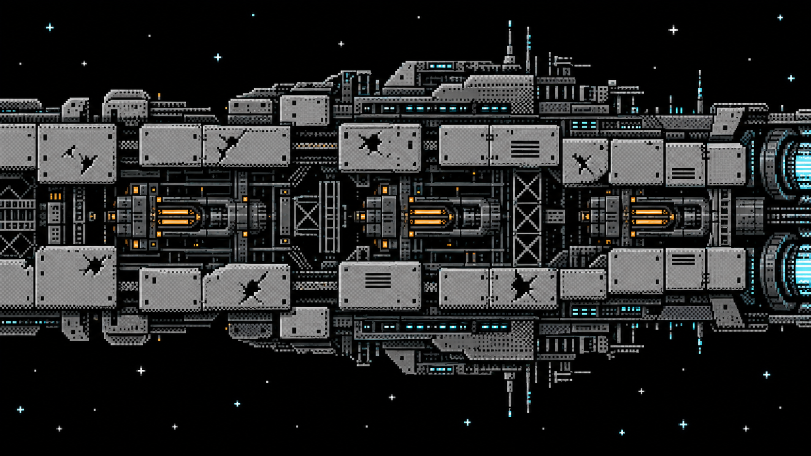
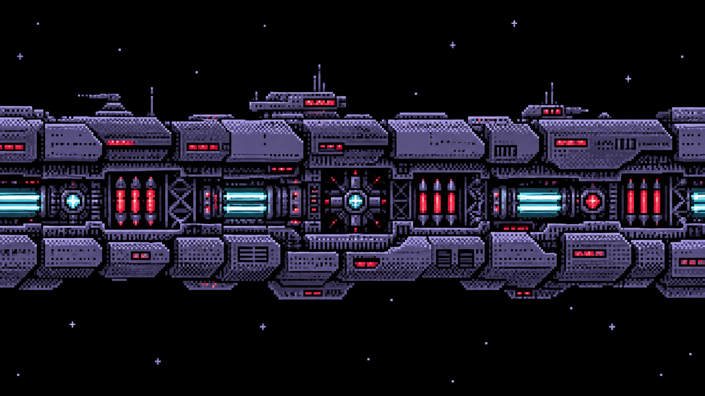
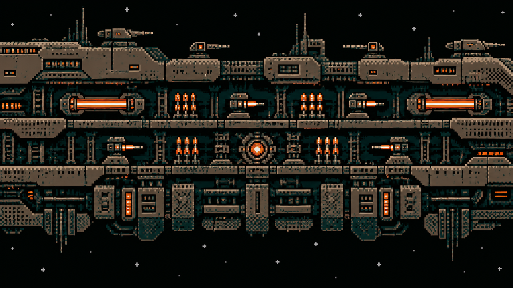

# VOID STRIKE 65 — modular boss concepts

**Concept art / planned feature**

**These bosses are not implemented and are not in the current playable build.**
Blockade Breaker, Siege Spine, and Void Citadel are working names.
The illustrations are more detailed than final Atari graphics and show the
artistic direction and mechanics, not final sprites.

## Shared encounter design

Each boss is larger and wider than the screen and slowly oscillates from side
to side. The screen acts as a window onto the part of the structure currently
passing through view.

The structure consists of destructible modules arranged in **two to four
layers**. Outer modules can shield modules deeper inside. A gun in a deeper
layer cannot fire until the module directly in front of it has been destroyed.
Removing cover therefore exposes both a new target and a new threat.

There is **no conventional boss health bar**. Destroying the **last weapon
module** defeats the boss; clearing every remaining armour module is not
required. Module and weapon placement should be irregular, with varied gaps
and depths, rather than a simple repeating pattern.

## Blockade Breaker

**Concept art / planned feature — two layers.**

A simpler construction built mainly around pulse cannons. Worn plates and
open structural bays make the relationship between cover and weapons easy to
read. This encounter teaches the player to destroy shielding and expose the
guns behind it, while keeping the module layout uneven.

## Siege Spine

**Concept art / planned feature — three layers.**

Pulse cannons and beam emitters occupy a more irregular structure. Staggered
armour and recessed weapon bays suggest several alternative routes through
the modules. The player can choose which section to dismantle first, opening
different weapons as the outer layers fall away.

## Void Citadel

**Concept art / planned feature — four layers.**

The densest construction, intended for a late encounter or the final boss.
Pulse cannons, beam emitters, and salvo launchers sit at different depths.
Breaking through one area can reveal weapons while other sections remain
shielded, extending the layered destruction mechanic across a large,
irregular fortress.

Click any illustration to open the original image at full size.

(C) 2026 SETECH GAME STUDIO

[Back to the project](../README.md)
